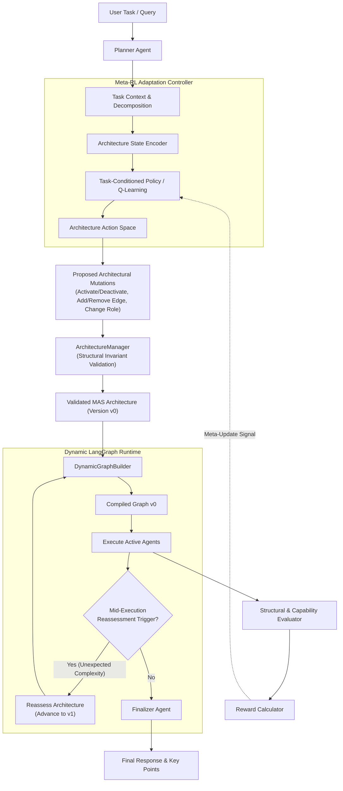

# Meta-RL Based Adaptive Architecture for LLM-Based Multi-Agent Systems (Adaptive MAS)

[](https://www.python.org/downloads/)
[](https://github.com/langchain-ai/langgraph)
[](https://pytorch.org/)
[](https://docs.pydantic.dev/)
[](https://docs.pytest.org/)

> **A foundational research and runtime framework that uses Meta-Reinforcement Learning to dynamically adapt the architectural composition, agent roles, and communication topology of LLM-based multi-agent systems to diverse and unseen task distributions.**

---

## 📑 Table of Contents

1. [Project Overview & Motivation](#-project-overview--motivation)
2. [What Makes This Project Differ from Existing Systems?](#-what-makes-this-project-differ-from-existing-systems)
   - [Comparison Matrix](#literature-comparison-matrix)
   - [Core Differentiators](#key-innovations--differentiators)
3. [Research Questions & Objectives](#-research-questions--objectives)
4. [System Architecture](#-system-architecture)
5. [Repository Structure & Design Rationale ("Why These Exist")](#-repository-structure--design-rationale)
   - [Architecture Layer (`app/architecture/`)](#1-architecture-layer-apparchitecture)
   - [Agent Pool (`app/agents/`)](#2-agent-pool-appagents)
   - [Dynamic LangGraph Engine (`app/graph/`)](#3-dynamic-langgraph-engine-appgraph)
   - [Reinforcement Learning & Meta-RL (`app/rl/`)](#4-reinforcement-learning--meta-rl-apprl)
   - [Runtime Orchestration (`app/runtime/`)](#5-runtime-orchestration-appruntime)
   - [Evaluation & Reward System (`app/evaluation/`)](#6-evaluation--reward-system-appevaluation)
6. [Formal MDP & Meta-RL Specification](#-formal-mdp--meta-rl-specification)
   - [State Representation](#state-representation-s)
   - [Action Space](#action-space-a)
   - [Reward Formulation](#reward-formulation-r)
   - [Closed-Loop Adaptation](#closed-loop-adaptation-flow)
7. [Dynamic Execution & Runtime Reassessment](#-dynamic-execution--runtime-reassessment)
8. [Installation & Setup](#-installation--setup)
9. [Usage Guide](#-usage-guide)
   - [Interactive CLI](#running-the-interactive-cli)
   - [Controlled Multi-Task Evaluation](#running-multi-task-evaluation)
   - [Running Tests](#running-the-test-suite)
10. [Research Team](#-research-team)

---

## 🌟 Project Overview & Motivation

Large Language Model-based Multi-Agent Systems (LLM-MAS) enable collaborative reasoning, code generation, and complex problem-solving. However, virtually all contemporary multi-agent frameworks organize agents into **static, predetermined topologies**:
- **Fixed Composition:** The set of agents participating in the workflow is predefined and inflexible.
- **Static Roles:** Agents have immutable responsibilities regardless of varying task nuances.
- **Hardcoded Communication:** Information flows along rigid pipelines (e.g., sequentially or fully-connected), irrespective of whether the task requires deep research, quick conversation, or rigorous verification.

### The Problem
A fixed multi-agent architecture is intrinsically suboptimal across heterogeneous task distributions:
- **Resource Inefficiency:** Simple queries trigger redundant agent handoffs (e.g., passing a simple greeting through a Planner $\to$ Researcher $\to$ Coder $\to$ Critic $\to$ Finalizer pipeline), wasting API tokens and inflating latency.
- **Capability Mismatch:** Complex tasks may lack critical verification loops or domain-specific communication paths.
- **Independent Search Overhead:** Traditional architecture search (NAS) methods optimize architectures from scratch on every single query, incurring prohibitive inference costs and latency.

### The Core Paradigm Shift
$$\text{From designing an architecture for a task} \implies \text{\textbf{Learning how to rapidly adapt the architecture across task distributions.}}$$

This project introduces **Adaptive MAS**, a meta-learning and runtime orchestration framework that learns reusable architectural adaptation policies. Given a user task and architecture state, the system dynamically mutates agent activation, roles, and directed communication edges, compiling a tailored [LangGraph](https://github.com/langchain-ai/langgraph) workflow on the fly.

---

## 🚀 What Makes This Project Differ from Existing Systems?

Existing literature demonstrates dynamic architecture search and Meta-RL independently. This project investigates their underexplored intersection: **using Meta-RL to adapt discrete MAS architectures**.

### Literature Comparison Matrix

| System / Paradigm | Examples / Citations | Composition Adaptation | Role Adaptation | Topology Adaptation | Cross-Task Transfer | Meta-Learning | Target of Adaptation |
| :--- | :--- | :---: | :---: | :---: | :---: | :---: | :--- |
| **Static MAS** | AutoGen, CrewAI, ChatDev, static LangGraph | ❌ | ❌ | ❌ | ❌ | ❌ | None (Fixed graph) |
| **Dynamic Selection / Recruitment** | AgentVerse (ICLR 2024) | ✅ | ✅ | ⚠️ | ⚠️ | ❌ | Agent roster selection |
| **Architecture Search (NAS / Supernets)** | MaAS (ICML 2025), AutoMaAS (2025) | ✅ | ✅ | ✅ | ⚠️ | ❌ | Single-query search (high per-task search cost) |
| **Meta-RL for Agents** | LaMer (ICLR 2026), MAML-en-LLM (2024) | ⚠️ | ⚠️ | ⚠️ | ✅ | ✅ | Individual agent weights/prompts |
| **RL-based Design** | MetaAgent-X (2026) | ✅ | ✅ | ✅ | ⚠️ | ❌ | Single-task optimization |
| **This Project (Adaptive MAS)** | **Meta-RL Adaptive MAS** | **✅** | **✅** | **✅** | **✅** | **✅** | **Full MAS Architecture (Composition + Roles + Graph Topology + Activation)** |

*(Legend: ✅ = Core capability; ⚠️ = Partial / indirect support; ❌ = Not supported)*

---

### Key Innovations & Differentiators

#### 1. The Target of Adaptation is the MAS Architecture Itself
Unlike conventional agent adaptation frameworks that modify agent prompts or fine-tune LLM weights (e.g., MAML-en-LLM), the adaptation target here is the **global system architecture**:
- **Who:** Which agents exist and are active.
- **What:** Which functional roles are assigned to agents.
- **How:** The directed communication graph defining information routing.

#### 2. Meta-Learning vs. Per-Task Architecture Search
Frameworks like MaAS or AutoMaAS perform combinatorial search or supernet routing from scratch for every query. In contrast, Adaptive MAS trains a **task-conditioned meta-policy** across task distributions ($T \sim p(T)$). The policy learns an architectural prior that enables **few-step adaptation on unseen tasks**, drastically lowering adaptation latency and token expenditure.

#### 3. Two-Stage Dynamic Adaptation (Pre-Execution + Mid-Execution Reassessment)
- **Stage 1 (Pre-Execution):** The Planner parses the task requirements and conditions the architecture mutation. The system compiles only the necessary agent nodes into a custom DAG.
- **Stage 2 (Mid-Execution / Runtime Reassessment):** The runtime executes graph $v_0$ up to a reassessment boundary (e.g., after the Researcher or Coder). Intermediate outputs are monitored. If unforeseen complexity or verification failure is detected mid-stream, the runtime halts, triggers an architecture reassessment, mutates the graph to $v_1$ (e.g., spawning a Critic node and rewiring edges), and resumes execution seamlessly with the accumulated state.

#### 4. Dynamic LangGraph Graph Compilation from Validated Architecture State
Rather than simulating adaptation through conditional prompt branches, Adaptive MAS translates mutated architecture models directly into dynamically compiled, executable [LangGraph](app/graph/dynamic_builder.py) `StateGraph` instances. Nodes that are deactivated are completely excised from the runtime execution graph.

#### 5. Guardrailed Discrete MDP with Architectural Invariants
All mutations (`activate_agent`, `deactivate_agent`, `add_edge`, `remove_edge`, `change_role`) pass through the [ArchitectureManager](app/architecture/manager.py). This enforces structural invariants:
- Prevention of disconnected graphs and invalid edge references.
- Disallowance of self-loops and orphaned communication pathways.
- Automatic routing bypasses (e.g., automatically routing around deactivated Critic nodes straight to the Finalizer).
- Preservation of mandatory core agents.

#### 6. Deterministic Offline Proxies & Safe Meta-Training
To prevent runaway LLM costs during extensive Meta-RL exploration, the framework decouples:
- **Offline Meta-Training:** Fast, deterministic capability-coverage and connectivity proxies ([TaskPerformanceEvaluator](app/evaluation/task_performance.py)).
- **Online Deployment:** Live LLM agent execution ([ExistingLLMAgentExecutor](app/runtime/llm_execution.py)) backed by OpenRouter or NVIDIA NIM.

---

## 🎯 Research Questions & Objectives

This repository serves as the experimental testbed for five core research questions:

- **RQ1:** Can Meta-RL learn reusable architectural adaptation knowledge across diverse task distributions?
- **RQ2:** Can an LLM-MAS rapidly reconfigure composition, roles, and topology for previously unseen tasks?
- **RQ3:** Which architectural dimensions (composition vs. role assignment vs. communication topology) contribute most to cross-task adaptation?
- **RQ4:** Does meta-learned architectural adaptation provide superior cross-task generalization, adaptation speed, and cost compared to static and architecture-search baselines?
- **RQ5:** Can dynamic architectural adaptation substantially improve the Pareto-optimal trade-off between task performance and inference cost?

---

## 🏗 System Architecture



---

## 📁 Repository Structure & Design Rationale

Every directory and module in this codebase is decoupled to support rigorous experimentation, reproducible testing, and clean separation of concerns:

```
RL_Based_AMAS/
├── app/
│   ├── agents/                  # Role-specialized LLM agent implementations
│   ├── architecture/            # Formal architecture model, mutations, & validation
│   ├── config/                  # Environment settings and LLM configurations
│   ├── controller/              # High-level adaptation control wrappers
│   ├── evaluation/              # Structural evaluators, reward engines, & benchmarks
│   ├── graph/                   # Dynamic LangGraph builders and state management
│   ├── memory/                  # Session trace storage
│   ├── rl/                      # Meta-RL environments, state/action encodings, & trainers
│   ├── runtime/                 # End-to-end execution orchestrator & live LLM dispatch
│   └── main.py                  # Interactive CLI entrypoint
├── tests/                       # Comprehensive unit, integration, & experiment test suite
├── pyproject.toml               # Project metadata and dependencies
└── requirements.txt             # Pinned production dependencies
```

---

### 1. Architecture Layer (`app/architecture/`)
*Why this exists:* Encapsulates the formal representation of a multi-agent system as a discrete mathematical graph, independent of LangGraph or RL specifics.

- [`models.py`](app/architecture/models.py): Defines [AgentDefinition](app/architecture/models.py#L12-L63), [CommunicationEdge](app/architecture/models.py#L68-L90), and [MASArchitecture](app/architecture/models.py#L95-L249). Guarantees that every architecture state can be verified for structural validity and serialized without leaking secrets.
- [`actions.py`](app/architecture/actions.py): Defines the discrete mutation operations ([ActionType](app/architecture/actions.py#L9-L17)): `ACTIVATE_AGENT`, `DEACTIVATE_AGENT`, `ADD_EDGE`, `REMOVE_EDGE`, `CHANGE_ROLE`.
- [`manager.py`](app/architecture/manager.py): The [ArchitectureManager](app/architecture/manager.py) acts as the state gatekeeper. It checks candidate actions against current topology, validates resulting graphs, and ensures safety.
- [`adaptive.py`](app/architecture/adaptive.py): Implements [AdaptiveArchitecture](app/architecture/adaptive.py#L25-L179), maintaining deterministic transition histories, version counters ($v_0, v_1, \dots$), and atomic rollback capabilities.
- [`llm_adapter.py`](app/architecture/llm_adapter.py): Implements [LLMArchitectureAdapter](app/architecture/llm_adapter.py), enabling LLM-guided recommendations to be mapped onto validated [ArchitectureAction](app/architecture/actions.py#L23-L86) instances while discarding invalid or hallucinated mutations.

---

### 2. Agent Pool (`app/agents/`)
*Why this exists:* Provides clean, stateless, and role-specialized LLM agents designed to execute as isolated nodes in a LangGraph graph.

- [`planner.py`](app/agents/planner.py): Decomposes the user task into steps, required capabilities, and boolean flags (`requires_research`, `requires_coding`, `requires_verification`).
- [`researcher.py`](app/agents/researcher.py): Gathers external context and synthesizes findings.
- [`coder.py`](app/agents/coder.py): Generates technical implementations and code snippets.
- [`critic.py`](app/agents/critic.py): Evaluates candidate solutions, detects edge cases, and recommends corrections.
- [`finalizer.py`](app/agents/finalizer.py): Consolidates all prior node outputs into a coherent final response with clear takeaways and limitations.

---

### 3. Dynamic LangGraph Engine (`app/graph/`)
*Why this exists:* Bridges abstract architectural definitions into physical, executable LangGraph compilation.

- [`state.py`](app/graph/state.py): Defines [MASState](app/graph/state.py), the global message and execution context passed across nodes.
- [`dynamic_builder.py`](app/graph/dynamic_builder.py): The [DynamicGraphBuilder](app/graph/dynamic_builder.py#L41-L134) takes an adapted `MASArchitecture` and planner requirements, filters active nodes, connects configured communication edges, sets up bypass routes for deactivated agents, and calls `.compile()` to produce a runnable LangGraph instance.
- [`adaptive_integration.py`](app/graph/adaptive_integration.py): Generates workflow execution plans and verifies LangGraph compatibility before execution.
- [`workflow.py`](app/graph/workflow.py): Maintains the fixed static baseline workflow for comparative benchmarking.

---

### 4. Reinforcement Learning & Meta-RL (`app/rl/`)
*Why this exists:* Implements the complete mathematical apparatus for modeling architecture reconfiguration as a Reinforcement Learning and Meta-RL problem.

- [`state.py`](app/rl/state.py): [ArchitectureStateEncoder](app/rl/state.py#L45-L115) maps a `MASArchitecture` into deterministic, vector-based observation tensors (activity vector, role vector, adjacency matrix).
- [`action_space.py`](app/rl/action_space.py): [ArchitectureActionMapper](app/rl/action_space.py#L63-L188) establishes a bijective mapping between discrete integer IDs and concrete `ArchitectureAction` mutations.
- [`environment.py`](app/rl/environment.py): [MASArchitectureEnv](app/rl/environment.py) provides a Gymnasium-compatible environment featuring state transitions, reward returns, and penalties for invalid structural actions.
- [`meta_task.py`](app/rl/meta_task.py): Encapsulates task categories, required capabilities, difficulty ratings, and [MetaTaskContext](app/rl/meta_task.py#L18-L45).
- [`task_distribution.py`](app/rl/task_distribution.py): Defines task families (Conversational, Research, Coding, Mathematical, Verification) and handles training vs. held-out task splits.
- [`meta_environment.py`](app/rl/meta_environment.py): Manages isolated, multi-task episode resets.
- [`q_learning.py`](app/rl/q_learning.py): Tabular Q-learning baseline and [TaskAwareStateEncoder](app/rl/q_learning.py#L74-L135).
- [`meta_controller.py`](app/rl/meta_controller.py): Algorithm-agnostic orchestrator collecting trajectories across diverse tasks.
- [`meta_trainer.py`](app/rl/meta_trainer.py): Implements multi-task inner/outer learning loops.
- [`task_conditioned_policy.py`](app/rl/task_conditioned_policy.py): Neural network policy module mapping concatenated task context and architecture state to action logits.
- [`meta_neural_trainer.py`](app/rl/meta_neural_trainer.py): Trains shared neural policies across task distributions and quantifies fast adaptation advantages on unseen test tasks compared to training from scratch.
- [`task_transfer.py`](app/rl/task_transfer.py) & [`transfer_evaluation.py`](app/rl/transfer_evaluation.py): Measures zero-shot and few-shot cross-task transfer efficiency.

---

### 5. Runtime Orchestration (`app/runtime/`)
*Why this exists:* Serves as the operational engine that unifies planning, adaptation, dynamic compilation, and LLM execution.

- [`orchestrator.py`](app/runtime/orchestrator.py): [AdaptiveRuntimeOrchestrator](app/runtime/orchestrator.py#L107-L585) provides:
  - `run()`: Executes static baseline or pre-adapted workflows.
  - `run_dynamic()`: Dynamically builds the LangGraph graph and supports **mid-execution runtime reassessment** ($v_0 \to v_1$).
- [`llm_execution.py`](app/runtime/llm_execution.py): [ExistingLLMAgentExecutor](app/runtime/llm_execution.py#L72-L343) coordinates actual LLM invocations, recording full execution telemetry and node handler callbacks.

---

### 6. Evaluation & Reward System (`app/evaluation/`)
*Why this exists:* Provides deterministic, reproducible metric computation for both offline RL optimization and online qualitative validation.

- [`evaluator.py`](app/evaluation/evaluator.py): Computes structural metrics (connectivity, agent activity ratio, redundancy, graph compactness).
- [`reward.py`](app/evaluation/reward.py): Computes scalar rewards from evaluation score deltas ($\Delta R = S_{t+1} - S_t$) and penalizes invalid transitions.
- [`task_performance.py`](app/evaluation/task_performance.py): Evaluates task-architecture capability coverage offline without calling LLMs.
- [`multi_task_evaluation.py`](app/evaluation/multi_task_evaluation.py): Controlled evaluation runner executing diverse tasks (Conversational, Research, Coding, Coding+Verification) through the pipeline to prove that different task requirements synthesize distinct LangGraph topologies from the same starting architecture.

---

## 📐 Formal MDP & Meta-RL Specification

### State Representation ($S$)
An architecture state $s \in \mathcal{S}$ is deterministically encoded into:
$$s = \langle \mathbf{v}_{\text{active}}, \mathbf{v}_{\text{role}}, \mathbf{A}, \mathbf{c}_{\tau} \rangle$$
Where:
- $\mathbf{v}_{\text{active}} \in \{0, 1\}^N$: Binary vector indicating whether agent $i$ is active.
- $\mathbf{v}_{\text{role}} \in \mathcal{R}^N$: Categorical role vector mapping agents to designated capabilities.
- $\mathbf{A} \in \{0, 1\}^{N \times N}$: Directed adjacency matrix indicating communication channels.
- $\mathbf{c}_{\tau}$: Task context vector (required capabilities, estimated complexity, task domain).

### Action Space ($A$)
Discrete architectural transitions:
$$a \in \mathcal{A} = \{\text{ACTIVATE}(i), \text{DEACTIVATE}(i), \text{ADD\_EDGE}(i, j), \text{REMOVE\_EDGE}(i, j), \text{CHANGE\_ROLE}(i, r)\}$$

### Reward Formulation ($R$)
For a valid transition:
$$R(s_t, a_t, s_{t+1}) = \text{Score}(s_{t+1}, \tau) - \text{Score}(s_t, \tau) - \lambda \cdot \text{Cost}(s_{t+1})$$
For an invalid transition (violating structural invariants):
$$R(s_t, a_t, s_{t+1}) = -1.0 \quad (\text{Invalid Transition Penalty})$$

### Closed-Loop Adaptation Flow
1. **Context Encoding:** Encode task query and baseline architecture into state $s_0$.
2. **Action Selection:** The policy selects an architectural action $a_t \sim \pi_\theta(a \mid s_t, c_\tau)$.
3. **Validation & Transition:** The action is applied via `ArchitectureManager`. If valid, $s_{t+1}$ is produced; otherwise penalized.
4. **Dynamic Compilation:** When adaptation terminates, `DynamicGraphBuilder` compiles the active subgraph.
5. **Execution & Reward Feedback:** The graph is invoked, metrics are collected, and meta-gradients are computed to update policy $\pi_\theta$.

---

## ⚡ Dynamic Execution & Runtime Reassessment

Adaptive MAS supports **dynamic graph pruning** and **mid-stream reassessment**. Below is an example of how execution paths diverge based on task requirements:

```
Task: "Hello, how are you?" (Simple Conversation)
  ├── Static Baseline Invocation: Planner ──> Researcher ──> Coder ──> Critic ──> Finalizer (Inefficient)
  └── Adaptive MAS Invocation:    Planner ──────────────────────────────────────────> Finalizer (Optimal)

Task: "Write a quick Python script" (Coding without verification)
  └── Adaptive MAS Invocation:    Planner ──> Coder ────────────────────────────────> Finalizer

Task: "Write a high-stakes banking algorithm and verify edge cases"
  ├── Pre-execution (v0):         Planner ──> Coder ──> Critic ──> Finalizer
  └── Mid-execution Trigger:      Coder output exposes unexpected concurrency issue
      └── Runtime Reassessment:  Graph dynamically adapts (v0 -> v1), activating Researcher for concurrency patterns
```

---

## ⚙️ Installation & Setup

### Prerequisites
- Python 3.10 or higher
- PowerShell or Bash

### 1. Clone the Repository
```bash
git clone https://github.com/naveen457/RL-based-adaptive-MAS.git
cd RL-based-adaptive-MAS
```

### 2. Create and Activate Virtual Environment
```powershell
# Windows
python -m venv .venv
.\.venv\Scripts\Activate.ps1

# Linux / macOS
python3 -m venv .venv
source .venv/bin/activate
```

### 3. Install Dependencies
```bash
pip install -r requirements.txt
pip install -e .
```

### 4. Configure Environment Variables
Copy `.env.example` to `.env` and fill in your API credentials:
```bash
cp .env.example .env
```

Edit `.env`:
```env
# NVIDIA NIM or OpenRouter API Settings
NVIDIA_API_KEY="your-nvidia-api-key"
NVIDIA_BASE_URL="https://integrate.api.nvidia.com/v1"
NVIDIA_MODEL="nvidia/nemotron-3.5-lightning-30b-a3b"

# Optional: LangSmith Observability
LANGCHAIN_TRACING_V2=true
LANGCHAIN_ENDPOINT=https://api.smith.langchain.com
LANGCHAIN_API_KEY="your-langsmith-api-key"
LANGCHAIN_PROJECT=adaptive-mas
```

---

## 💻 Usage Guide

### Running the Interactive CLI
Launch the adaptive runtime CLI:
```bash
python app/main.py
```
You can enter tasks interactively and observe:
- Baseline architecture verification
- Task understanding and capability analysis
- Accepted/rejected architectural actions
- Generated LangGraph topologies
- Complete runtime execution traces

---

### Running Multi-Task Evaluation
Run the controlled evaluation experiment demonstrating topological divergence across task families:
```powershell
.venv\Scripts\python.exe -m app.evaluation.multi_task_evaluation
```

---

### Running the Test Suite
Adaptive MAS includes a comprehensive suite of unit, integration, and property tests:
```powershell
.venv\Scripts\pytest.exe
```

Run tests with specific markers or modules:
```powershell
# Run RL environment and policy tests
.venv\Scripts\pytest.exe tests/test_rl_environment.py tests/test_meta_controller.py

# Run runtime dynamic graph compilation tests
.venv\Scripts\pytest.exe tests/test_runtime_orchestrator.py tests/test_dynamic_graph.py
```

---

## 👥 Research Team

- **Naveen Tanikonda** (23BCE9787)
- **Veerabhadra Jagarlamudi** (23BCE9780)
- **Sriram Somarouthu** (23BCE20270)
- **Ravi Teja Perumalapalli** (23BCE9392)

**Faculty Guide:** Dr. Srinivasarao Pokuri  
*School of Computer Science and Engineering*

---

## 📜 Citation & License

This project is developed as an academic research project investigating the intersection of Meta-Reinforcement Learning and LLM-based Multi-Agent Systems. Distributed under the MIT License.
